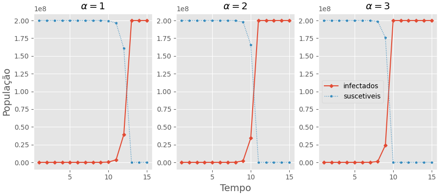
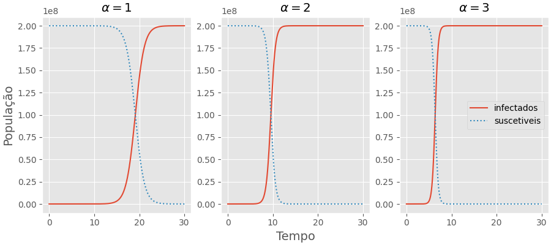

# Modelo SI

Temos uma variável aleatória $X$ que pode assumir a condição $S$ ou $I$, suscetível ou infectado. E parametrizamos essas condições de acordo com uma variável que indica o tempo $t$, de forma mais simplista, um indivíduo $X$ no tempo $t$ está suscetível a infecção ($X_{t} = S$) ou está infectado ($X_{t} = I$).

## Medidas/Inferências de Interesse

1. Probabilidade de um indivíduo estar suscetível no tempo t dado o evento/asserção A (informação disponível): $P(X_t = S | A)$
2. Probabilidade de um indivíduo estar infectado no tempo t dado o evento/asserção A (informação disponível): $P(X_t = I | A)$

Lembrando que a relação entre **1** e **2** é dada por:

$$P(X_t = S | A) + P(X_t = I | A) = 1$$

## Modelo de Transmissão

$$P(I_{t^\prime} | S_{t} A)$$

onde $I_{t^\prime}$ é equivalente a $X_{t^\prime} = I$, $t^\prime$ é um indicador do momento de transição que está entre $t$ e $t+1$ e $S_t$ equivale a $X_{t} = S$.

## Premissa

A probabilidade do indivíduo estar infectado no instante $t+1$ é a probalidade dele "estar suscetível em $t$ e se infectar em $t^\prime$" ou já "estar infectado em $t$". Logo:

$$P(I_{t+1}|A) =  P(S_t | A) P(I_{t^\prime} | S_t A) + P(I_t | A)$$

Usando essa mesma expressão, podemos obter a probabilidade do indivíduo estar suscetível no instante $t+1$:

$$1 - P(I_{t+1} | A)$$

$$P(S_{t+1}) = P(S_{t} | A) - P(S_{t} | I_{t^\prime} A)$$

## Parametrização do modelo de transmissão

Com um único parâmetro $\alpha$, podemos parametrizar a transmissão com base na probabilidade de infectados considerando o intervalo de tempo $\Delta t$ e a probabilidade do indivíduo estar infectado em $t$ visto que é preciso haver infectados para que haja transmissão.

$$P(I_{t^\prime} | S_{t} A) = \alpha P(I_t | A) \, \Delta t$$

De forma mais simplificada, considerando os indvíduos indistinguíveis entre si, podemos considerar $P(I_{t^\prime} |S_t A) = \frac{i_{t^\prime}}{s_t \, N}$ e $P(I_t | A) = \frac{i_t}{N}$ onde $N = s + i$ é a população total.

$$
\begin{gathered}
\frac{P\left(I_{t+1} \mid A\right)-P\left(I_t \mid A\right)}{P\left(S_t \mid A\right)}=P\left(I_{t^{\prime}} \mid S_t A\right) \Longrightarrow i_{t^{\prime}}=N\left(i_{t+1}-i_t\right)=N \Delta i \\
\frac{i_{t^{\prime}}}{s_t N}=\alpha \, \Delta t \frac{i_t}{N} \\
\boxed{\frac{i_{t^{\prime}}}{s_t}=\alpha \,\Delta t \, i_t} \\
\frac{\Delta i}{\Delta t}=\frac{\alpha \, s_t \, i_t}{N}
\end{gathered}
$$

## Evolução Temporal das populações S e I

### Tempo $t$ como variável discreta

**Infectados**

$$
\begin{aligned}
i_{t+1}-i_t &=\frac{\alpha \Delta t}{N} s_t i_t \\
i_{t+1} &=i_t+\frac{\alpha \Delta t}{N} s_t i_t \\
\boxed{i_{t+1} &=i_t\left(1+\frac{\alpha \Delta t}{N} s_t\right)}
\end{aligned}
$$

**Suscetíves**

$$
\begin{gathered}
\frac{P\left(S_{t+1} \mid A\right)-P\left(S_t \mid A\right)}{P\left(S_t \mid A\right)}=-P\left(I_{t^{+}} \mid S_t A\right) \Longrightarrow-i_{t^{+}}=N\left(s_{t+1}-s_t\right)=N \Delta s \\
s_{t+1}-s_t=-\frac{\alpha \Delta t}{N} i_t s_t \\
s_{t+1}=s_t-\frac{\alpha \Delta t}{N} i_t s_t \\
\boxed{s_{t+1}=s_t\left(1-\frac{\alpha \Delta t}{N} i_t\right)}
\end{gathered}
$$

### Tempo $t$ como variável contínua

Primeiramente é preciso tratar a variação $\Delta\,t$ como infinitesimal, no limite indo a zero em cada um dos casos.

**Infectados**

$$
\begin{aligned}
i_{t+1} - i_{t} &= \frac{\alpha\,\Delta\,t}{N}s_{t}\,i_{t}\\
di &= \frac{\alpha\,s\,i}{N} dt
\end{aligned}
$$

$$
\begin{aligned}
 \int_{i_0}^i\left(\frac{1}{N(N-i)}+\frac{1}{N i}\right) d i&=\frac{\alpha}{N} t \\
 \frac{1}{N}\left(\int_{i_0}^i \frac{d i}{(N-i)}+\int_{i_0}^i \frac{d i}{i}\right)&=\frac{\alpha}{N} t \\
 -\ln (N-i)+\ln \left(N+i_0\right)+\ln (i)-\ln \left(i_0\right)&=\alpha t \\
 \ln \left[\frac{\left(N-i_0\right)}{i_0} \frac{i}{(N-i)}\right]&=\alpha t \\
 \frac{\left(N-i_0\right)}{i_0} \frac{i}{(N-i)}&=e^{\alpha t} \\
 i \frac{\left(N-i_0\right)}{i_0}+i e^{\alpha t}&=N e^{\alpha t} \\
 i&=\frac{N e^{\alpha t}}{\frac{\left(N-i_0\right)}{i_0}+e^{\alpha t}} \\
 i&=\frac{i_0 e^{-\alpha t}}{i_0 e^{-\alpha t}} \frac{N e^{\alpha t}}{\frac{\left(N-i_0\right)}{i_0}+e^{\alpha t}} \\
\end{aligned}
$$

$$\boxed{i(t)=N \frac{i_0}{i_0+e^{-\alpha t}\left(N-i_0\right)}}$$

**Suscetíveis**

$$ds = -\frac{\alpha\,s\,i}{N} dt$$

$$\boxed{s(t)=N \frac{s_0}{s_0+e^{\alpha t}\left(N-s_0\right)}} = N - i(t)$$

