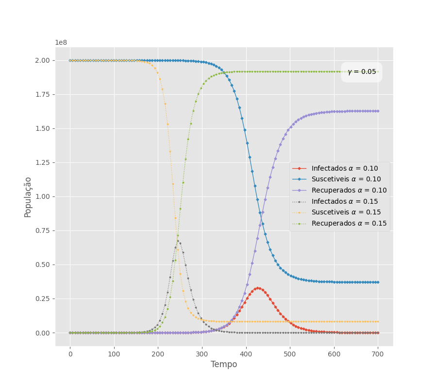
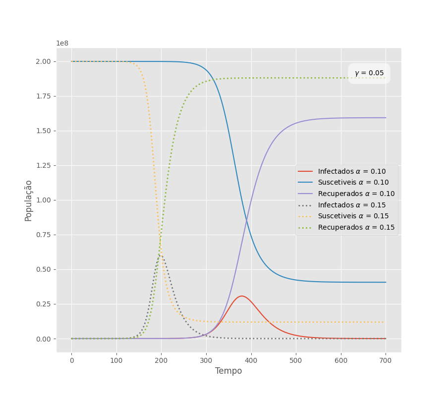
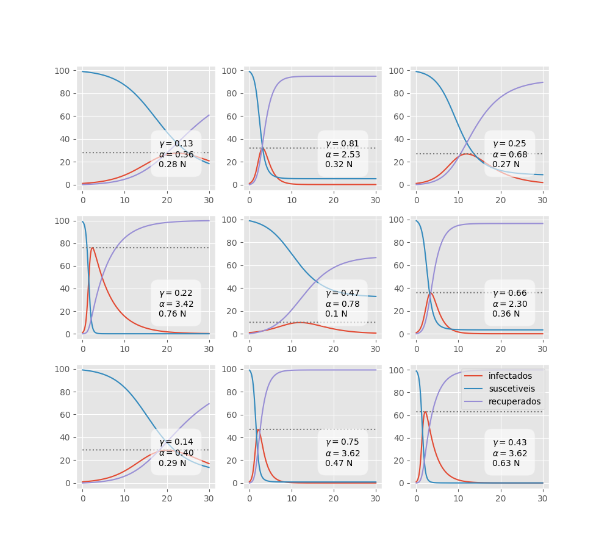
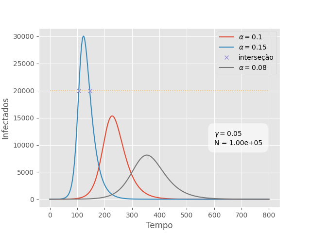

# Modelo SIR

A variável aleatória $X$ assume os valores $S$ - Suscetível, $I$ - Infectado, $R$ - Recuperado, onde o indivíduo não retorna ao estado suscetível caso se recupere.

## Medidas/Inferências de Interesse

1. Probabilidade de um indivíduo estar suscetível no tempo t dado o evento/asserção A (informação disponível): $P(X_{t} = S | A)$

2. Probabilidade de um indivíduo estar infectado no tempo t dado o evento/asserção A (informação disponível): $P(X_{t} = I | A)$

3. Probabilidade de um indivíduo estar recuperado no tempo t dado o evento/asserção A (informação disponível): $P(X_{t} = R | A)$

De forma que

$$P(X_{t} = S | A) + P(X_{t} = I | A) + P(X_{t} = R | A) = 1$$

e

$$
\begin{aligned}
P(X_{t} = S | A) &= P(S_{t} | A) = \frac{s_{t}}{N}\\
P(X_{t} = I | A) &= P(I_{t} | A) = \frac{i_{t}}{N}\\
P(X_{t} = R | A) &= P(R_{t} | A) = \frac{r_{t}}{N}\\
\end{aligned}
$$

Onde $N = s_{t} + i_{t} + r_{t}$ que garante que a soma das probabilidades seja igual a $1$.

## Modelo de Transmissão

Temos dois possíveis cenários de transição de um estado para outro no instante de transição $t^\prime$ que está entre $t$ e $t+1$.

1. Indivíduo está suscetível e passa a estar infectado

$$P(I_{t^\prime} | S_{t} A)$$

2. Indivíduo está infectado e passa a estar recuperado

$$P(R_{t^\prime} | I_{t} A)$$

## Premissas

A probabilidade do indivíduo estar infectado no instante $t+1$ é a probalidade dele "(estar suscetível em $t$ e se infectar em $t^\prime$)" ou já "estar infectado em $t$ e não se recuperar em $t^\prime$ dado que está infectado em $t$". Logo:

$$P(I_{t+1}|A) =  P(S_{t} | A) P(I_{t^\prime} | S_{t} A) + P(I_{t} | A)(1 - P(R_{t^\prime}|I_{t}A))$$

A probalidade do indivíduo estar recuperado no instante $t+1$ é a probabilidade dele "estar recuperado em $t$" ou "estar infectado em $t$ e se recuperar em $t^\prime$", o que leva a:

$$P(R_{t+1}|A) = P(R_{t}|A) + P(I_{t} | A) P(R_{t^\prime} | I_{t} A)$$

A probalidade do indivíduo estar suscetível no instante $t+1$ pode ser definida por "não ('se infectar em $t+1$' ou  'estar infectado em $t$ e se recuperar em $t^\prime$')":

$$
\begin{aligned}
P\left(S_{t+1} \mid A\right) & =1-\left[P\left(I_{t+1} \mid A\right)+P\left(I_{t} \mid A\right) P\left(R_{t^{+}} \mid I_{t} A\right)\right] \\
& =1-P\left(I_{t} \mid A\right)+P\left(I_{t} \mid A\right) P\left(R_{t^{+}} \mid I_{t} A\right)-P\left(S_{t} \mid A\right) P\left(I_{t^{+}} \mid S_{t} A\right)-P\left(I_{t} \mid A\right) P\left(R_{t^{+}} \mid I_{t} A\right) \\
& =P\left(S_{t} \mid A\right)-P\left(S_{t} \mid A\right) P\left(I_{t^{+}} \mid S_{t} A\right)
\end{aligned}
$$

## Parametrizações do modelo de transmissão

Exatamente como no modelo SI, com o parâmetro $\alpha$, podemos parametrizar a transmissão com base na probabilidade de infectados considerando o intervalo de tempo $\Delta t$ e a probabilidade do indivíduo estar infectado em $t$ visto que é preciso haver infectados para que haja transmissão.

$$P(I_{t^\prime} | S_{t} A) = \alpha \Delta t P(I_{t} | A )$$

Enquanto que a probabilidade do indivíduo se recuperar dependerá unicamente do tempo e uma taxa de reabilitação/recuperação $\gamma$ dado que estamos considerando apenas indivíduos infectados.

$$P(R_{t^\prime} | I_{t} A) = \gamma \Delta t$$

É importante mencionar que essa parametrização poderia ser diferente em cenários mais complexos e possuir dependência das populações de suscetíveis e/ou recuperados.

## Evolução Temporal das populações S, I e R

**Suscetíveis

$$
\begin{aligned}
\frac{s_{t+1}}{N} & =\frac{s_{t}}{N}-\frac{s_{t}}{N} \frac{\alpha \Delta t i_{t}}{N} \\
N \cdot\left(\frac{s_{t+1}}{N}\right) & =N \cdot\left(\frac{s_{t}}{N}-\frac{s_{t}}{N} \frac{\alpha \Delta t i_{t}}{N}\right) \\
s_{t+1} & =s_{t}-s_{t} \frac{\alpha \Delta t i_{t}}{N} \\
\end{aligned}
$$

$$\boxed{s_{t+1} =s_{t}\left(1-\frac{\alpha \Delta t}{N} i_{t}\right)}$$

**Infectados**

$$
\begin{aligned}
\frac{i_{t+1}}{N} & =\frac{i_{t}}{N}(1-\gamma \Delta t)+\frac{s_{t}}{N} \frac{\alpha \Delta t i_{t}}{N} \\
N \cdot\left(\frac{i_{t+1}}{N}\right) & =N \cdot\left(\frac{i_{t}}{N}(1-\gamma \Delta t)+\frac{s_{t}}{N} \frac{\alpha \Delta t i_{t}}{N}\right) \\
i_{t+1} & =i_{t}-i_{t} \gamma \Delta t+\frac{\alpha \Delta t i_{t}}{N} s_{t} \\
\end{aligned}
$$

$$\boxed{i_{t+1} =i_{t}\left(1-\gamma \Delta t+\frac{\alpha \Delta t}{N} s_{t}\right)}$$

**Recuperados**

$$
\begin{aligned}
\frac{r_{t+1}}{N} & =\frac{r_{t}}{N}+\frac{i_{t}}{N} \gamma \Delta t \\
N \cdot\left(\frac{r_{t+1}}{N}\right) & =N \cdot\left(\frac{r_{t}}{N}+\frac{i_{t}}{N} \gamma \Delta t\right) \\
\end{aligned}
$$

$$\boxed{r_{t+1} =r_{t}+i_{t} \gamma \Delta t}$$

## Sistema de interesse

No regime contínuo, obtemos o sistema de equações diferenciais no qual se usou a notação comum $\dot{x} = dx/dt$:

$$
\begin{aligned}
\dot{s}(t) & =-\frac{\alpha}{N} s(t) i(t) \\
\dot{i}(t) & =\left(\frac{\alpha}{N} s(t)-\gamma\right) i(t) \\
\dot{r}(t) & =r(t)+\gamma i(t)
\end{aligned}
$$

## Gráficos

**Tempo discreto**

Para o tempo contínuo, foi escolhido o método odeint do módulo integrate da biblioteca sciPy, método numérico que permite integrar equações diferenciais ordinárias.

**Tempo contínuo**

## Situação-problema

Nos casos mais próximos do cenário real, devemos levar em conta que os sistema de saúde não consegue absorver toda uma população infectada. Neste caso, lidaremos com limites de 20% a 90% da população total para fins de análise, sendo $N = 2 \cdot 10^{8}$.

Logo, qual devem ser os parâmtros $\gamma$ e $\alpha$ para que a população de infectados não ultrapasse esse limite?

Após observar cenários com diferentes $\alpha$s e $\gamma$s, nota-se uma relação não trivial onde a razão entre eles é um provável fator de maior influência quando se trata do limite de infectados.

Por meio de tentativa e erro é possível ajustar um polinômio de grau altíssimo $>20$ para obter previsões da relação $\alpha/\gamma$. Os valores utilizados se encontram são os da tabela

|$alpha/gamma$|fração de $N$|
|-----------|-----------|
|1.65       |    0.10   |
|2.20       |    0.20   |
|2.95       |    0.30   |
|3.90       |    0.40   |
|5.30       |    0.50   |
|7.50       |    0.60   |
|11.40      |   0.70    |
|14.70      |   0.75    |
|19.90      |   0.80    |
|29.05      |   0.85    |
|48.80      |   0.90    |
|114.60     |  0.95     |

Que corresponde aos valores aproximados de $\alpha/\gamma$ para os limites de infecção relativos à população total. Precisões mais altas requerem mais parâmetros e possivelmente outros métodos pois existe um dependência sutil do número de indivíduos $N$.

Exemplo com pseudo-random generators para $N=100$.

Outra abordagem possível é resolver as equações diferenciais e obter uma função explícita para $i(t)$ e então determinar o valor de i no ponto de inflexão ($d^2 i/dt^2 = 0$) e aí determinar os fatores de influência no número máximo de infectados.

Supondo que os parâmetros $\alpha$, $\gamma$ e a capacidade do sistema de saúde estão bem estimados, é possível também estimar o instante no qual o sistema irá colapsar caso o limite de infecção seja ultrapassado de forma simples, basta levar em conta o primeiro ponto de interseção entre a curva de infectados e a reta indicadora de capacidade. Nesse cenário temos uma dependência significativa do número de indivíduos na população.

Exemplo:

